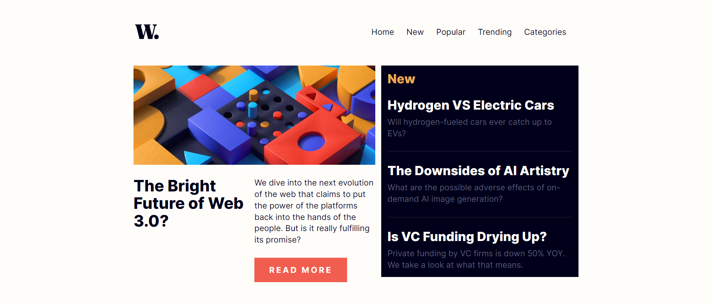
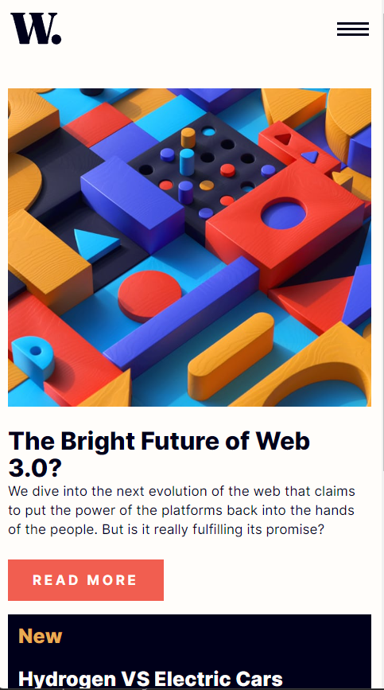

# Frontend Mentor - News homepage solution

## Table of contents

- [Overview](#overview)
  - [Screenshot](#screenshot)
  - [Links](#links)
- [My process](#my-process)
  - [Built with](#built-with)
  - [What I learned](#what-i-learned)
  - [Continued Development](#continued-development)
- [Author](#author)

## Overview

### The challenge

Users should be able to:

- View the optimal layout for the interface depending on their device's screen size
- See hover and focus states for all interactive elements on the page
- **Bonus**: Toggle the mobile menu (requires some JavaScript)

### Screenshot

### Links
- Live Site URL: [News Homepage Website](https://farris1.github.io/news-homepage/)

## My process

### Built with

- Semantic HTML5 markup
- CSS custom properties
- Flexbox
- Mobile-first workflow
- JavaScript
- [Vite](https://vitejs.dev/guide/) - JS library

### Continued development

I'd like to add the navbar concept to many of my future developed websites.

## Author

- Discord Server - [CatStudios](https://discord.gg/3Gn3DxSS3Y)
- Discord User - [CatStudios#0975]
- Twitter - **COMING SOON**
